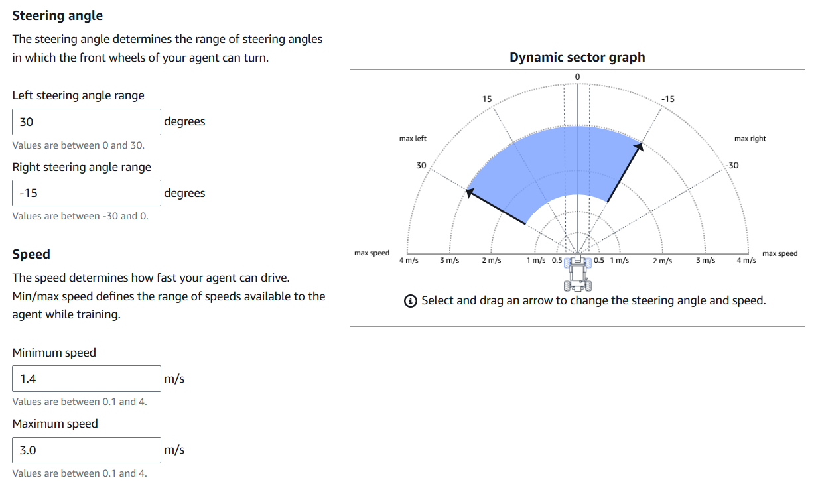

## Approach

A **reinforcement learning** approach was used, where the agent (the DeepRacer car) receives rewards for taking correct actions and penalties for undesirable behaviors. The model was trained to navigate the **re:Invent 2018 track** from AWS.

### Continuous Action Space Settings

To train the model, we defined the settings for its continuous action space. The action space settings influenced how the agent made decisions during training, and fine-tuning them helped us achieve optimal performance on the track.

